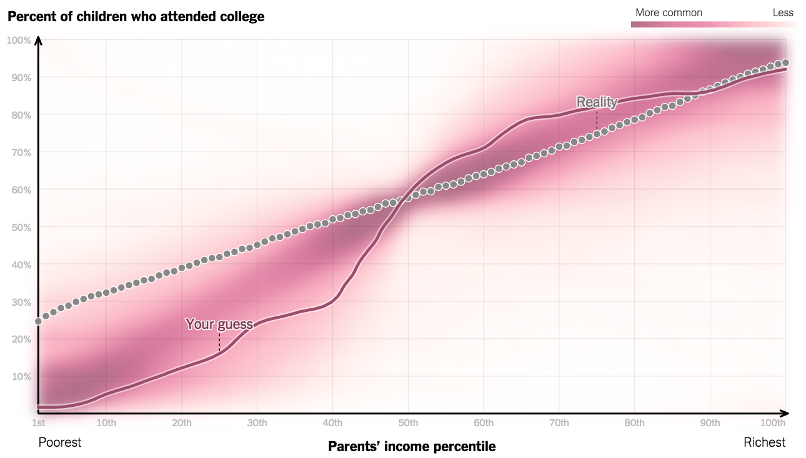

# Data-Driven Journalism Collection
##### curated by [@pushthings4ward](http://www.twitter.com/pushthings4ward)

# Books

* 	[The Art and Science of Data-Driven-Journalism](http://towcenter.org/wp-content/uploads/2014/05/Tow-Center-Data-Driven-Journalism.pdf) by Alexander Benjamin Howard
*	[Finding Stories in Spreadsheets](https://leanpub.com/spreadsheetstories) by Paul Bradshaw
*	[Scraping for Journalists](https://leanpub.com/scrapingforjournalists) by Paul Bradshaw
*	[So lügt man mit Statistik](http://www.amazon.de/So-l%C3%BCgt-man-mit-Statistik/dp/3492264131/ref=sr_1_3?ie=UTF8&qid=1431690234&sr=8-3&keywords=wie+l%C3%BCgt+man+mit+statistik) by Walter Krämer
*	[Tiger That Isn't: Seeing Through a World of Numbers](http://www.amazon.de/Tiger-That-Isnt-Through-Numbers/dp/1846681111/ref=sr_1_1?ie=UTF8&qid=1431690285&sr=8-1&keywords=the+tiger+that+isn%27t) by Michael Blastland
*	[Numbers in the newsroom: Using math and statistics in news](http://www.amazon.com/Numbers-newsroom-Using-math-statistics/dp/B0006E8VEC) by Sarah Cohen
*	[Visualize This!](http://www.amazon.de/Visualize-This-Nathan-Yau/dp/3527760229/ref=sr_1_3?ie=UTF8&qid=1431690325&sr=8-3&keywords=nathan+yau) by Nathan Yau
*	[Die perfekte Infografik: Wie man Zahlen, Daten, Fakten richtig präsentiert - und wie nicht](http://www.amazon.de/Die-perfekte-Infografik-richtig-pr%C3%A4sentiert/dp/3868812776/ref=sr_1_1?ie=UTF8&qid=1431690490&sr=8-1&keywords=die+perfekte+infografik) by  Donna M. Wong
*	[The Data Journalism Handbook](http://datajournalismhandbook.org/) by Jonathan Gray, Lucy Chambers, Liliana Bounegru
*	[Guides, case studies and resources for government & civil society on the “what, why & how” of open data](http://opendatahandbook.org/)
*	[Data Science at the Command Line](http://datascienceatthecommandline.com/)  by Jeroen Janssens
*	[Stats: Data and Models (3rd Edition)](http://www.amazon.com/Stats-Models-Richard-D-Veaux/dp/0321692551/ref=sr_1_1?ie=UTF8&qid=1435134787&sr=8-1&keywords=stats+and+models+3rd+edition) by Richard D. De Veaux et al.

# Articles

* 	[Storytelling with Data Visualization: Context is King](http://towcenter.org/storytelling-with-data-visualization-context-is-king/)
* 	[Drawing Conclusions From Data](https://source.opennews.org/en-US/learning/statistically-sound-data-journalism/)

# Blogs

*	[Guradian Data Blog](http://www.theguardian.com/data)
*	[The Upshot](http://www.nytimes.com/upshot)
*	[Five Thirty Eight](http://fivethirtyeight.com)
*	[The ProPublica Nerd Blog](https://www.propublica.org/nerds)
*	[Chicago Tribune News Apps Blog](http://blog.apps.chicagotribune.com)
*	[Source](https://source.opennews.org)
*	[Datenlese](http://www.spiegel.de/thema/daten)
*	[Flowing Data: Visualization and Statistics](http://flowingdata.com/)
*	[NZZ Data](http://www.nzz.ch/data/)
*	[BuzzFeed Data Blog](http://www.buzzfeed.com/datablog)

# Videos

*	[Journalism in the Age of Data](http://datajournalism.stanford.edu/noflash.html)
* 	[Aron Pilhofer: “Data Can Be A Source And Tell Stories”](http://blogs.cccb.org/lab/en/video_aron-pilhofer-les-dades-poden-ser-una-font-i-explicar-histories/)
*	[The Joy of Stats](https://www.youtube.com/watch?v=jbkSRLYSojo)
*	[Mariano Rivera Cutter: The Mechanics of His Signature Pitch](https://www.youtube.com/watch?v=dMVXjRGTtG0&feature=player_embedded)

# Tools

*	__OpenRefine:__ [OpenRefine is a powerful tool for working with messy data.](http://openrefine.org/)
*	__Tabula:__ [Tabula is a tool for liberating data tables locked inside PDF files.](http://tabula.technology/)
*	__Scraper:__ [Web Scraper is a chrome browser extension built for data extraction from web pages.](https://chrome.google.com/webstore/detail/web-scraper/jnhgnonknehpejjnehehllkliplmbmhn)
*	__RStudio:__ [RStudio IDE is a powerful and productive user interface for R](http://www.rstudio.com/)
*	__GitHub:__ [Powerful collaboration, code review, and code management for open source and private projects.](https://github.com/)
*	__Colorbrewer:__ [Color advice for cartography](http://colorbrewer2.org/)

# CLI

*	__ngrok:__ [Secure tunnels to localhost](https://ngrok.com/)
*	__csvkit:__ [csvkit is a suite of utilities for converting to and working with CSV, the king of tabular file formats.](http://csvkit.readthedocs.org/en/latest/index.html)
*	__journalism:__ [journalism is a Python library that takes the horror out of basic data analysis and manipulation.](http://journalism.readthedocs.org/en/0.4.0/index.html)
*	__node:__ [As an asynchronous event driven framework, Node.js is designed to build scalable network applications.](https://nodejs.org/download/)
*   __bower:__ [A package manager for the web](http://bower.io)
*	__pip:__ [pip is a package management system used to install and manage software packages written in Python.](https://www.python.org/ftp/python/2.7.10/python-2.7.10-macosx10.6.pkg)
*	__t:__ [A command-line power tool for Twitter.](https://github.com/sferik/t)
*	__social-shares:__ [A command-line and programmatic interface to various social sharecount endpoints.](https://github.com/debrouwere/social-shares)
*	__IPython:__ [IPython is a command shell for interactive computing in multiple programming languages.](http://ipython.org/install.html)
*	__homebrew:__ [The missing package manager for OS X](https://raw.githubusercontent.com/Homebrew/install/master/install)
*	__wget:__ [wget is a computer program that retrieves content from web servers](https://www.gnu.org/software/wget/)
*	__grunt:__ [The JavaScript Task Runner](http://gruntjs.com/)

# Tutorials

*	[OpenRefine Tutorials](https://github.com/OpenRefine/OpenRefine/wiki/External-Resources)
*	[How to scrape Toronto data: a basic tutorial](http://datadrivenjournalism.net/resources/how_to_scrape_toronto_data_a_basic_tutorial)
*	[Command Line Tutorial](https://github.com/onyxfish/command-line-tutorial)
*	[A ggplot2 cheatsheet](http://zevross.com/blog/2014/08/04/beautiful-plotting-in-r-a-ggplot2-cheatsheet-3/)

# Data sources

*	[GOVDATA](https://www.govdata.de/)
*	[Statistisches Bundesamt](https://www.destatis.de)

# Visualisation

*	[News Graphics Collection](http://collection.marijerooze.nl/)
*	[DDJ Katalog](http://katalog.datenjournalismus.net/#/)
*	[Graphic Libraries](http://selection.datavisualization.ch/)

# SNA

*	[Connecting the Dots Behind the 2016 Presidential Candidates](http://www.nytimes.com/interactive/2015/05/17/us/elections/2016-presidential-campaigns-staff-connections-clinton-bush-cruz-paul-rubio-walker.html)
*	[This is Who Republican Presidential Contenders Follow on Twitter](http://www.bloomberg.com/politics/graphics/2015-who-republican-candidates-follow/)

# Food for thought

*	[People have no idea what inequality actually looks like](http://www.washingtonpost.com/blogs/wonkblog/wp/2015/05/18/people-have-no-idea-what-inequality-actually-looks-like/)
*	[How Family Income Affects Children’s College Chances](http://www.nytimes.com/interactive/2015/05/28/upshot/you-draw-it-how-family-income-affects-childrens-college-chances.html?abt=0002&abg=1&_r=0)
